# DishDrop 🥘

DishDrop is a modern offline-first recipe app, developed with Flutter. It allows you to conveniently store, organize, and suggest recipes, as well as create shopping lists – all locally and lightning-fast thanks to ObjectBox.

## Features 🚀

### Cookbook 📚
- Recipes with title, image, category, preparation time, cooking time, difficulty level, tags, ingredients, cooking steps and notes
- 6 categories for recipes (e.g., “Main Courses”, “Salads”, etc.)
- Favorites feature & counter showing how often a recipe was cooked
- Servings picker to automatically adjust quantities
- Create shopping lists directly from a recipe’s ingredients

<table>
<tr>
<td></td>
<td>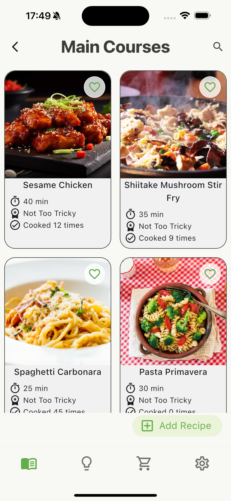</td>
<td>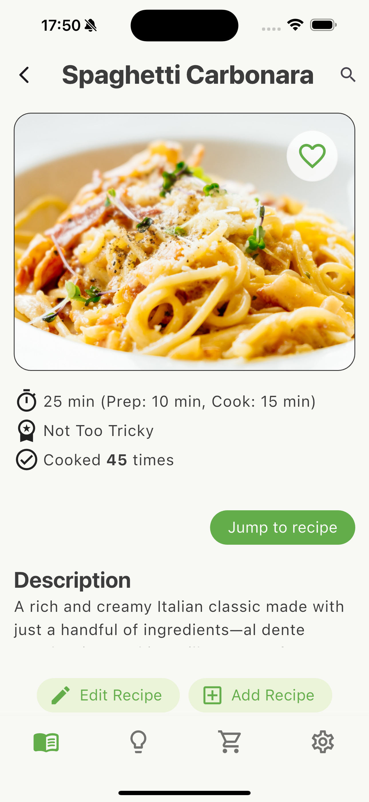</td>
<td>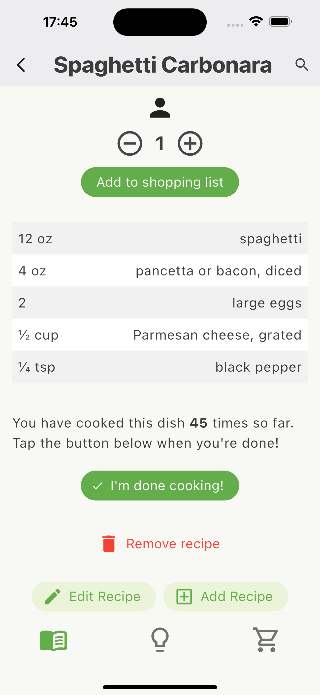</td>
</tr>
<tr>
<td colspan="4" >From category view to recipe detail view</td>
</tr>
</table>

<table>
<tr>
<td>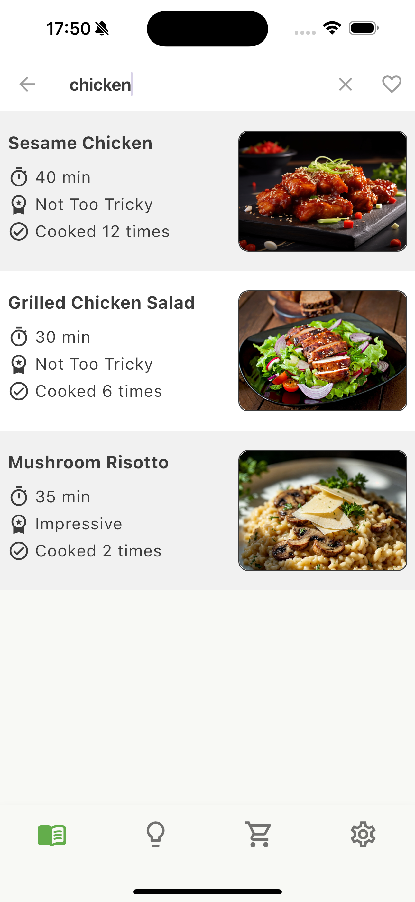</td>
</tr>
<tr>
<td>A search bar at the top of the screen, including filtering by favorites/non-favorites</td>
</tr>
</table>

<table>
<tr>
<td>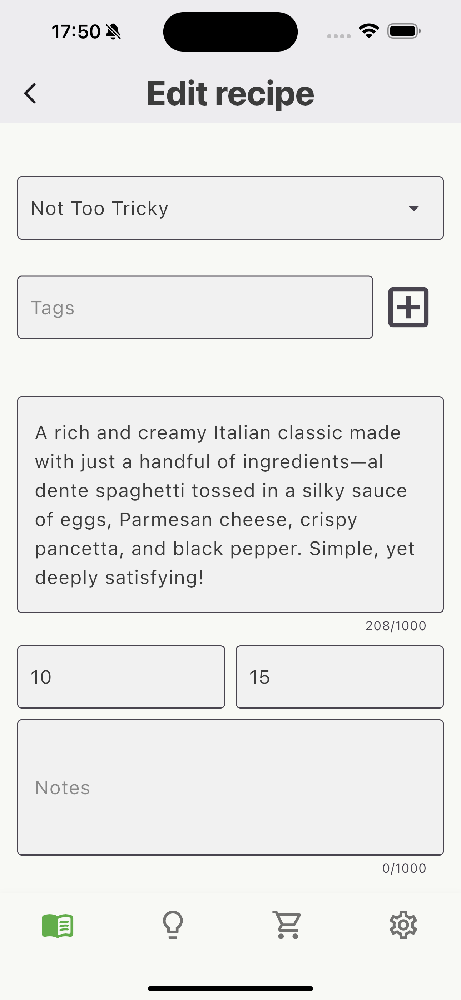</td>
<td>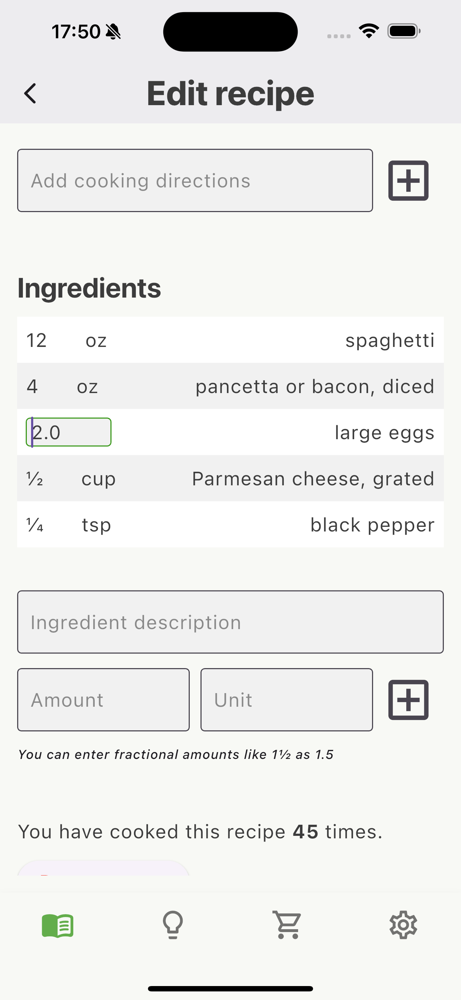</td>
</tr>
<tr>
<td colspan="2" >Editing a recipe</td>
</tr>
</table>

### EinkaufslShopping Listsisten 🛒
- Two types: all-purpose list & recipe-bound list
- Shopping items can be checked off and deleted

<table>
<tr>
<td>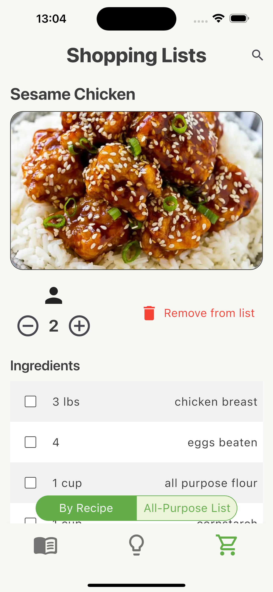</td>
<td>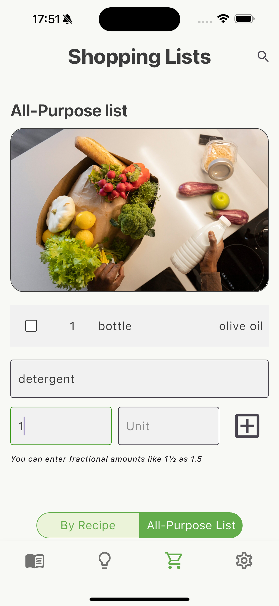</td>
</tr>
<tr>
<td colspan="2" >Recipe-bound list (left) and all-purpose list (right)</td>
</tr>
</table>

### Suggestion Feature 🎲
- Smart recipe suggestions based on user preferences (e.g., time, category, favorites)
- Alternatively: “Just give me something” button for quick inspiration
- Integrated search with filtering options

<table>
<tr>
<td>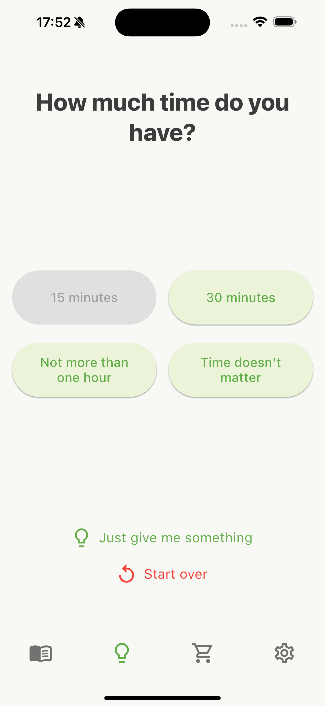</td>
<td>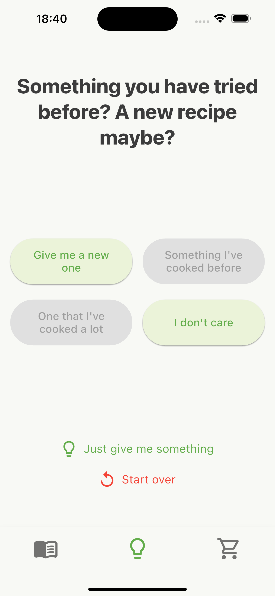</td>
<td>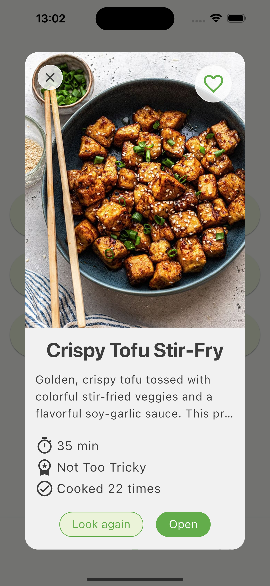</td>
</tr>
<tr>
<td colspan="3" >After just a few short questions, the user gets a suggested recipe. Parameters that don’t match any existing recipe are greyed out.</td>
</table>

## Technology Stack / Packages  🧱
- Flutter: Cross-platform UI toolkit
- Dart: Programming language for Flutter
- ObjectBox: High-performance local NoSQL database
- Provider: State management
- Shared Preferences: Simple data storage
- Image Picker: Load images from gallery
- Flutter Gen: Automated asset handling
- Flutter Launcher Icons: Custom app icons
    
👉 Full list: see pubspec.yaml

## Project Structure 🗂️

The project follows a modular structure inspired by the Layer-First principle (e.g., separation of UI, data, and logic):

<pre>
<code>
lib/
├── core/              → UI-Theming und Hilfsfunktionen (z. B. Farben, Textstyles, Utils)
├── data/              → Datenmodelle, Provider, Repositories, ObjectBox-Datenbank
├── ui/                → Screens und Widgets, teilweise nach Features gruppiert
│   ├── screens/       → Hauptansichten (Rezepte, Empfehlungen, Einkaufsliste)
│   ├── widgets/       → Wiederverwendbare UI-Komponenten, gruppiert nach Kontext/Feature
├── gen/               → Automatisch generierte Assets via flutter_gen
├── dish_drop_app.dart → Einstiegspunkt für App-Setup
└── main.dart          → App-Startpunkt (runApp)

</code>	
</pre>

## To Do / Further Potential 📝
- User authentication (for ObjectBox Sync)
- Deployment for Android
- Light mode / dark mode toggle
- Timer with stay-awake functionality (keeps screen on)
- Group ingredients (e.g., ingredients for roast, ingredients for sauce, etc.)
- Photos for individual cooking steps for better visualization
- Speech-to-text function, to keep hands free while cooking
